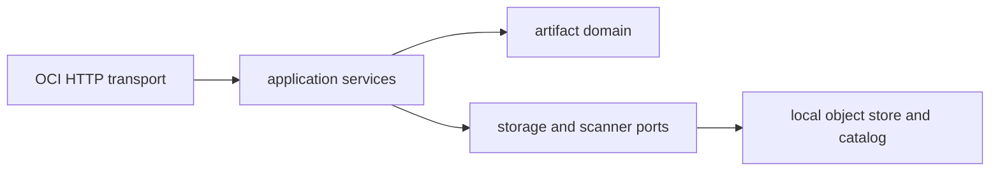

# Artifact Registry

纯 Go 1.23 的 OCI Distribution 风格内容寻址制品与构建缓存注册中心。默认使用本地分层对象存储和并发安全内存索引，应用层通过端口接口隔离 PostgreSQL、S3、漏洞扫描与复制适配器。

已实现 OCI `/v2/` 仓库、manifest、tag、blob、referrers、分片上传、断点续传、SHA-256 校验、Range 请求、blob mount、扫描生命周期、保留策略、审计字段、租户配额和 GC dry-run/execute。外部适配器尚未绑定时明确返回 `UNIMPLEMENTED`。

运行：`go test ./... && go vet ./... && go run ./cmd/registry`。默认监听 `:8083`，配置见 `.env.example`。执行 GC 必须使用 `Idempotency-Key` 和 `X-Confirm-GC: delete-unreferenced-artifacts`。

